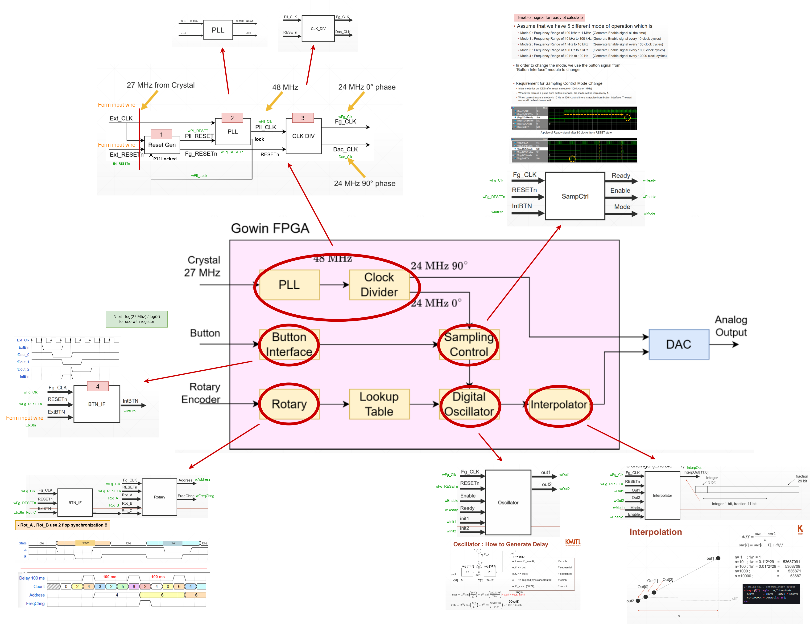
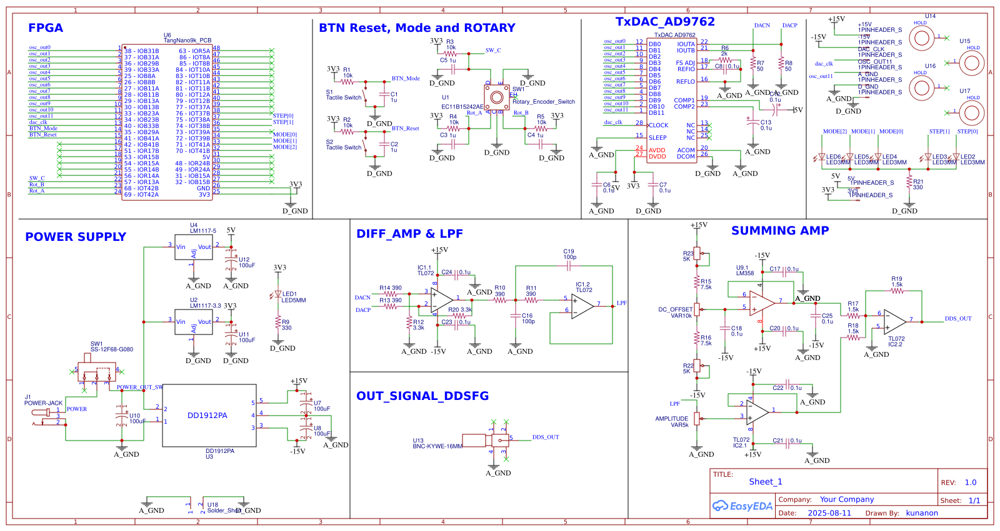
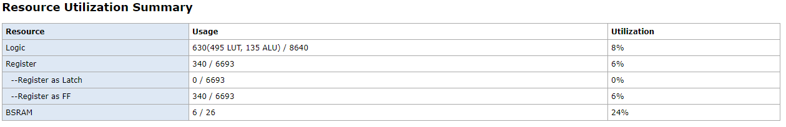
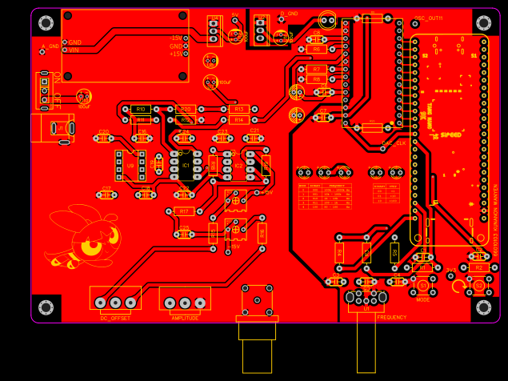
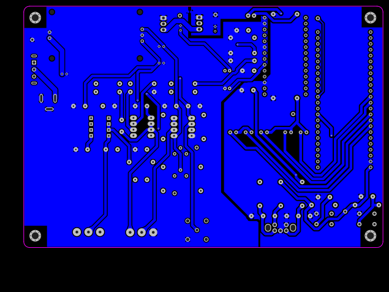
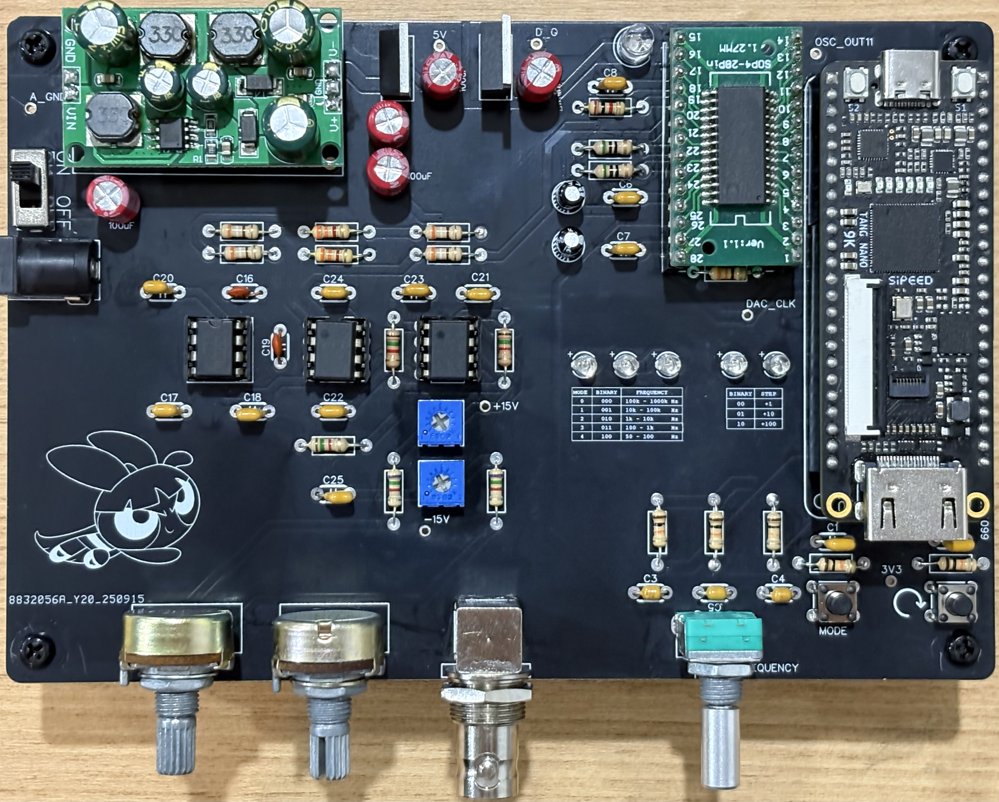

# Digital Direct Synthesis Function Generator
**[Project ElectronicsEng. Y3T1]**

## Overview

This project is the design and implementation of a **Function Generator** using **Direct Digital Synthesis (DDS)** — a technique for generating precise analog waveforms from a digital circuit. The core idea is to numerically compute waveform samples from a Look-Up Table (LUT) and convert them into an analog signal via a DAC (Digital-to-Analog Converter).

The entire system is implemented on a **Tang Nano 9K FPGA** (Gowin GW1NR-9), with all digital logic written in **Verilog HDL**, and a custom **PCB** designed to support the analog output stage and physical interfacing.

---

## How DDS Works

```
Phase Accumulator → Phase-to-Amplitude (LUT) → DAC → Analog Output
```

1. **Phase Accumulator** — A binary counter that increments by a Frequency Control on every clock cycle.
   
2. **Phase-to-Amplitude LUT** — The upper bits of the phase accumulator index into a ROM table storing one complete cycle of a waveform. This maps a phase value to the corresponding amplitude value.

3. **DAC (Digital-to-Analog Converter)** — Converts the digital amplitude values from the FPGA into a real analog voltage signal at the output.

---

## Tech Stack

| Component        | Details                        |
|------------------|--------------------------------|
| FPGA             | Tang Nano 9K (Gowin GW1NR-9)  |
| HDL Language     | Verilog                        |
| Synthesis Tool   | Gowin EDA                      |
| Simulation       | MATLAB / Testbench             |
| PCB Design       | EDA Tool                       |

---

## Project Structure

```
DDSFG/
├── src/DDSFG/         # Verilog source files (DDS core, top module, waveform LUT)
├── Simulation/        # Waveform simulation files and testbenches
├── Report/            # Project report and documentation
└── Document/          # Schematics, PCB layouts, and reference images
```

---

## Detail Mapping


## Schematic PCB


## Resource Summary


## PCB

### TOP


### BOTTOM


## Board

